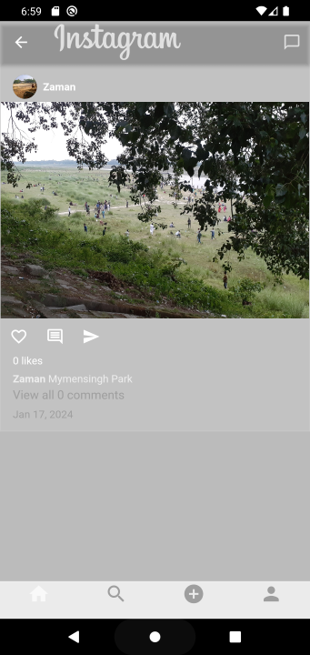

# Instagram Clone
I am trying to clone Instagram, but not all features are cloned.

# Contents:
* Just basic feature is implemented
* For database used firebase

# Feature
* Sign In and Sign Out with Firebase Auth
* Feed Screen
* Search Screen
* Add Post Screen but only image can be posted by user
* Profile Screen

# Dependencies:
* firebase_storage
* firebase_messaging
* firebase_auth
* firebase_core
* cloud_firestore
* flutter_svg
* image_picker
* provider
* flutter_staggered_grid_view: ^0.7.0
* uuid
* intl

# The Project:

You can run this project:

1. Direct on Android Studio Emulator by this [link](https://github.com/RashadZA/instagramc.git)
2. Physical Device. [Apk_link](https://drive.google.com/file/d/1NL0nxzupDFtwttNQZaWD7zBN1lD-VDAP/view?usp=sharing)

# How to Use the Project:
* Just install APK and explore features.

## APP Screenshots:

